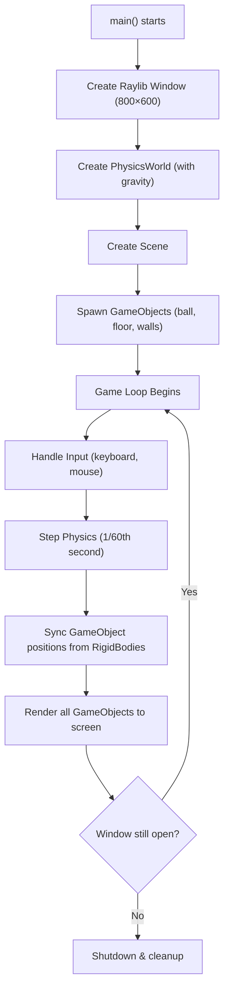
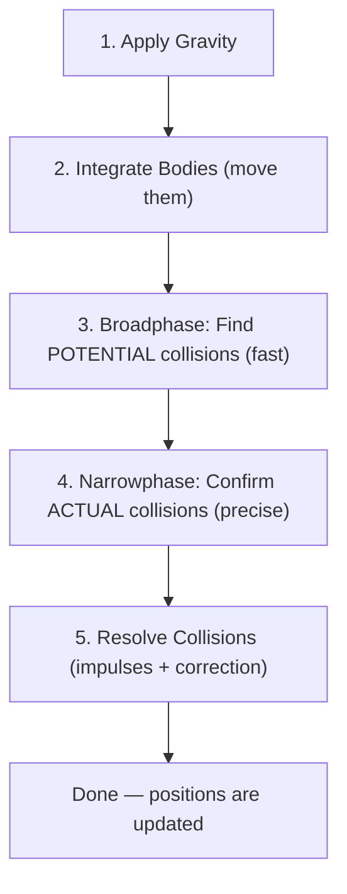
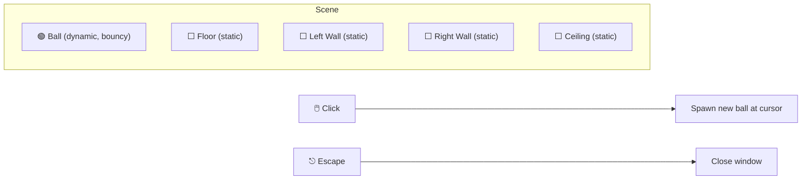
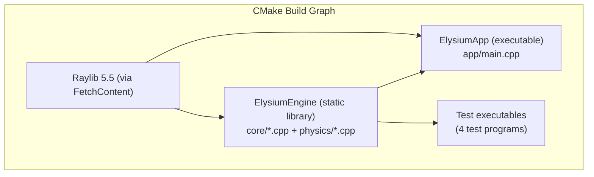

# 🏛️ ElysiumEngine — Project Knowledge

> A complete, beginner-friendly guide to the ElysiumEngine codebase.

---

## 1. What Is ElysiumEngine?

ElysiumEngine is a **2D game engine** written in **C++20**. Think of it as a simplified version of Unity or Godot — it gives you:

- A **window** to draw things on (using the Raylib library)
- A **physics simulation** (gravity, collisions, bouncing, friction)
- A **game object system** (creating and managing entities in a scene)
- A **renderer** (drawing shapes on screen)

Right now it's a working **prototype** focused on 2D physics. The long-term plan (see [PLAN.md](file:///home/aaka/Desktop/personal%20proj/Devsocengine/ElysiumEngine/PLAN.md)) is to evolve it into a full-featured 2D/3D engine with an ECS (Entity Component System), Lua scripting, a visual editor, and more.

---

## 2. Project Structure at a Glance

```
ElysiumEngine/
├── app/                    ← The demo application (entry point)
│   └── main.cpp            ← Creates window, spawns objects, runs game loop
│
├── engine/                 ← The engine itself (compiled as a static library)
│   ├── core/               ← Window, game objects, scene, rendering, input
│   │   ├── include/        ← Header files (.hpp)
│   │   └── src/            ← Implementation files (.cpp)
│   │
│   ├── physics/            ← Physics simulation (rigid bodies, colliders, solver)
│   │   ├── include/        ← Header files (.hpp)
│   │   └── src/            ← Implementation files (.cpp)
│   │
│   └── CMakeLists.txt      ← Builds the engine as a static library
│
├── test/                   ← Performance & correctness tests
│   ├── PhysicsPerformanceTest.cpp
│   ├── BroadPhasePerformanceTest.cpp
│   ├── BoundaryTest.cpp
│   └── FrictionTest.cpp
│
├── CMakeLists.txt          ← Top-level build file (fetches Raylib via FetchContent)
├── PLAN.md                 ← Detailed future development roadmap
└── README.md               ← Quick-start guide
```

---

## 3. How the Engine Runs (The Big Picture)

Here's what happens from the moment you launch the app to what you see on screen:



> **In plain English:** The app creates a window, sets up a physics world with gravity, adds some objects (a bouncy ball, walls, floor), then enters an infinite loop where it reads input → simulates physics → draws everything → repeats. When you close the window, it cleans up and exits.

---

## 4. The Core Module (engine/core/)

The core module handles everything that's **not** physics: the window, game objects, scenes, rendering, and input.

### 4.1 Application ([Application.hpp](file:///home/aaka/Desktop/personal%20proj/Devsocengine/ElysiumEngine/engine/core/include/Application.hpp) / [Application.cpp](file:///home/aaka/Desktop/personal%20proj/Devsocengine/ElysiumEngine/engine/core/src/Application.cpp))

The **base class** for any application built on the engine.

| Method | What It Does |
|---|---|
| `Init()` | Creates the Raylib window (800×600), initialises the PhysicsWorld and Scene |
| `Run()` | The main game loop — checks input, steps physics with a fixed timestep (1/60s), updates the scene, renders |
| — | Raylib handles events internally via polling functions (no explicit event handler needed) |
| `Shutdown()` | Closes the window and cleans up |

**Key concept — Fixed Timestep:** Physics is updated in fixed increments of 1/60th of a second (≈16.67ms). If the frame takes longer, multiple physics steps catch up. If it's faster, leftover time accumulates. This keeps physics consistent regardless of frame rate.

### 4.2 GameObject ([GameObject.hpp](file:///home/aaka/Desktop/personal%20proj/Devsocengine/ElysiumEngine/engine/core/include/GameObject.hpp))

A **game entity** — anything that exists in the game world (a ball, a wall, a player).

| Property | Type | Purpose |
|---|---|---|
| `name` | `std::string` | Human-readable name (e.g., "Player Ball") |
| `position` | `Vec3` | Where it is in the world (x, y, z) |
| `rotation` | `Quat` | Rotation quaternion |
| `scale` | `Vec3` | Size multiplier |
| `rigidBody` | `std::unique_ptr<RigidBody>` | Optional link to a physics body |

**`SyncWithPhysics()`** — If the GameObject has a linked RigidBody, this copies the physics body's position/rotation to the GameObject so it renders in the right place.

### 4.3 Scene ([Scene.hpp](file:///home/aaka/Desktop/personal%20proj/Devsocengine/ElysiumEngine/engine/core/include/Scene.hpp))

A **container** that holds all the GameObjects in the current level/world.

- `AddGameObject(...)` — adds a new entity
- `Update(float dt)` — calls `SyncWithPhysics()` on every game object
- `FindByName(string)` — searches for a specific game object

### 4.4 SimpleRenderer ([SimpleRenderer.hpp](file:///home/aaka/Desktop/personal%20proj/Devsocengine/ElysiumEngine/engine/core/include/SimpleRenderer.hpp))

A **thin wrapper** around Raylib's drawing functions.

1. `Render(scene)` — clears the screen (sage green), draws boundary box, draws all physics bodies (circles and rotated rectangles), optionally draws debug grid and AABBs, then presents the frame.

### 4.5 Input ([Input.hpp](file:///home/aaka/Desktop/personal%20proj/Devsocengine/ElysiumEngine/engine/core/include/Input.hpp))

Thin static wrapper around Raylib's built-in input functions:

- `IsKeyDown(key)` — is this key currently held down?
- `IsKeyPressed(key)` — was this key just pressed this frame?
- `IsMouseButtonPressed(button)` — was this mouse button just clicked this frame?
- `GetMousePosition()` — where is the cursor right now?
- `GetMouseWheelDelta()` — scroll wheel movement

### 4.6 Component ([Component.hpp](file:///home/aaka/Desktop/personal%20proj/Devsocengine/ElysiumEngine/engine/core/include/Component.hpp))

A basic **component system** (precursor to a full ECS):

- `Component` — base class with a virtual `Update(float dt)`
- `TransformComponent` — stores position, rotation, scale

### 4.7 Other Core Headers

| File | Purpose |
|---|---|
| [Core.hpp](file:///home/aaka/Desktop/personal%20proj/Devsocengine/ElysiumEngine/engine/core/include/Core.hpp) | Platform macros (`ELYSIUM_API` for DLL export), assertion macro |
| [Elysium.hpp](file:///home/aaka/Desktop/personal%20proj/Devsocengine/ElysiumEngine/engine/core/include/Elysium.hpp) | Umbrella header — `#include` this one file to get everything |
| [EntryPoint.hpp](file:///home/aaka/Desktop/personal%20proj/Devsocengine/ElysiumEngine/engine/core/include/EntryPoint.hpp) | Defines `main()` so client apps only need to implement `CreateApplication()` |

---

## 5. The Physics Module (engine/physics/)

This is the most fleshed-out part of the engine. It simulates **2D rigid-body physics** — objects with mass that move, collide, and bounce.

### 5.1 How Physics Works (Step by Step)

Every frame, [`PhysicsWorld::Step(dt)`](file:///home/aaka/Desktop/personal%20proj/Devsocengine/ElysiumEngine/engine/physics/src/PhysicsWorld.cpp) does this:



Let's break each step down:

#### Step 1: Apply Gravity
Every **dynamic** body gets a downward force added: `force += mass × gravity`. Static and kinematic bodies are skipped.

#### Step 2: Integrate (Move Bodies)
Each body's velocity and position are updated using **semi-implicit Euler integration** ([RigidBody.cpp](file:///home/aaka/Desktop/personal%20proj/Devsocengine/ElysiumEngine/engine/physics/src/RigidBody.cpp)):

```
acceleration = force / mass
velocity += acceleration × dt
velocity *= (1 - damping × dt)     ← damping slows things down gradually
position += velocity × dt
```

Forces are cleared after each step so they don't accumulate.

#### Step 3: Broadphase — Quick Pair Finding ([BroadPhase.hpp](file:///home/aaka/Desktop/personal%20proj/Devsocengine/ElysiumEngine/engine/physics/include/BroadPhase.hpp))

With 1000 objects, checking every pair for collision would be ~500,000 checks. The **Dynamic AABB Tree** (a type of Bounding Volume Hierarchy / BVH) cuts this down drastically.

**How it works:**
- Every object gets an **AABB** (Axis-Aligned Bounding Box) — the smallest rectangle that contains the object
- These AABBs are stored in a binary tree where parent nodes contain the merged AABB of their children
- To find potential collisions, the tree is traversed — only pairs whose AABBs overlap are reported
- The tree is **self-balancing** (uses rotations, like an AVL tree) for good performance
- AABBs are slightly "fattened" (expanded by 0.1 units) so small movements don't require tree rebuilds

#### Step 4: Narrowphase — Precise Collision Detection ([NarrowPhase.hpp](file:///home/aaka/Desktop/personal%20proj/Devsocengine/ElysiumEngine/engine/physics/include/NarrowPhase.hpp))

For each candidate pair from the broadphase, the exact shapes are tested:

| Pair Type | Algorithm |
|---|---|
| Circle vs Circle | Compare distance between centres to sum of radii |
| Box vs Box (AABB) | Check overlap on both X and Y axes, find minimum penetration |
| Circle vs Box | Find closest point on box to circle centre, check distance |

The result is a **CollisionPair** containing:
- The two bodies involved
- The **collision normal** (direction to push them apart)
- The **penetration depth** (how much they overlap)

#### Step 5: Collision Resolution — Sequential Impulse Solver

This is the most complex part. For each collision, the solver:

1. **Computes the relative velocity** at the contact point
2. **Calculates a normal impulse** — how hard to push the bodies apart (using restitution/bounciness)
3. **Calculates a friction impulse** — how much to slow sliding along the surface (clamped by Coulomb's friction law: friction ≤ μ × normal force)
4. **Applies impulses** to both bodies (equal and opposite, per Newton's 3rd law)
5. **Positional correction** — nudges overlapping bodies apart to prevent sinking (Baumgarte stabilization: 20% correction with 0.01 unit slop tolerance)

The solver runs **10 iterations** by default, refining the solution each time for more stable stacking.

### 5.2 Physics Classes in Detail

#### Vec2 ([CoreMath.hpp](file:///home/aaka/Desktop/personal%20proj/Devsocengine/ElysiumEngine/engine/physics/include/CoreMath.hpp))

A simple 2D vector — the building block of all physics math.

| Operation | What It Does |
|---|---|
| `+`, `-`, `*`, `/` | Vector arithmetic |
| `Dot(a, b)` | Dot product (scalar) — measures alignment |
| `Cross(a, b)` | 2D cross product (scalar) — measures perpendicularity |
| `Length()` | Magnitude (distance from origin) |
| `Normalized()` | Unit vector (same direction, length = 1) |

#### RigidBody ([RigidBody.hpp](file:///home/aaka/Desktop/personal%20proj/Devsocengine/ElysiumEngine/engine/physics/include/RigidBody.hpp))

The physics representation of an object.

| Property | Meaning |
|---|---|
| `m_Type` | **Static** (never moves), **Kinematic** (moves but unaffected by forces), **Dynamic** (fully simulated) |
| `m_Mass` / `m_InverseMass` | How heavy it is (static bodies have inverseMass = 0 so forces have no effect) |
| `m_Velocity` | Current speed and direction |
| `m_Restitution` | Bounciness (0 = no bounce, 1 = perfect bounce) |
| `m_Friction` | Surface roughness (higher = more friction) |
| `m_LinearDamping` | Air resistance for movement (slowly reduces velocity) |
| `m_Inertia` | Resistance to rotation (computed from shape and mass) |

#### Collider ([Collider.hpp](file:///home/aaka/Desktop/personal%20proj/Devsocengine/ElysiumEngine/engine/physics/include/Collider.hpp))

The **shape** used for collision detection (separate from the visual shape).

- **CircleCollider** — defined by a radius
- **BoxCollider** — defined by width and height

Each can compute its own AABB and rotational inertia.

#### AABB ([AABB.hpp](file:///home/aaka/Desktop/personal%20proj/Devsocengine/ElysiumEngine/engine/physics/include/AABB.hpp))

An Axis-Aligned Bounding Box (a rectangle that doesn't rotate). Used for fast overlap checks.

- `Intersects(other)` — do these two boxes overlap?
- `Merge(a, b)` — create a box that contains both
- `GetPerimeter()` — used as a cost metric in the BVH tree

---

## 6. The Demo App (app/main.cpp)

The [main.cpp](file:///home/aaka/Desktop/personal%20proj/Devsocengine/ElysiumEngine/app/main.cpp) file is a **demo/sandbox** that shows off the engine. Here's what it sets up:



- A green circle ball drops from the top and bounces off the floor/walls
- Click anywhere to spawn more balls
- Press Escape to quit

---

## 7. Tests

The project has **4 test programs** that verify physics correctness and performance:

| Test | What It Checks |
|---|---|
| [PhysicsPerformanceTest](file:///home/aaka/Desktop/personal%20proj/Devsocengine/ElysiumEngine/test/PhysicsPerformanceTest.cpp) | How fast `PhysicsWorld::Step()` runs with 100 / 500 / 1000 bodies |
| [BroadPhasePerformanceTest](file:///home/aaka/Desktop/personal%20proj/Devsocengine/ElysiumEngine/test/BroadPhasePerformanceTest.cpp) | Insert, query, update, remove performance of the AABB tree with 1000–5000 bodies |
| [BoundaryTest](file:///home/aaka/Desktop/personal%20proj/Devsocengine/ElysiumEngine/test/BoundaryTest.cpp) | Ball doesn't fall through the floor after physics simulation |
| [FrictionTest](file:///home/aaka/Desktop/personal%20proj/Devsocengine/ElysiumEngine/test/FrictionTest.cpp) | Friction actually slows objects down; different friction values produce different results |

---

## 8. Build System

The project uses **CMake** (version 3.15+) with C++20.



**To build:**
```bash
mkdir build && cd build
cmake ..
make
./ElysiumApp    # Run the demo
```

---

## 9. External Dependencies

| Library | Purpose | Included As |
|---|---|---|
| **Raylib 5.5** | Window creation, 2D/3D rendering, input handling, audio | CMake FetchContent (auto-downloaded) |

---

## 10. Where the Project Is Headed

According to [PLAN.md](file:///home/aaka/Desktop/personal%20proj/Devsocengine/ElysiumEngine/PLAN.md), the roadmap covers **12+ months** of development across 8 phases:

| Phase | Timeframe | What Gets Built |
|---|---|---|
| **Phase 1** — Foundation | Months 1–2 | Engine entry point, application layer, GLFW window/events, logging, basic OpenGL |
| **Phase 2** — Core Renderer | Months 3–4 | OpenGL abstraction, shaders, textures, framebuffers, batched 2D renderer, ImGui |
| **Phase 3** — Editor Shell | Month 5 | ImGui docking UI, hierarchy panel, inspector panel, scene serialization |
| **Phase 4** — ECS & Scene | Month 6 | EnTT integration, built-in components, prefabs, entity picking |
| **Phase 5** — Physics & Scripting | Months 7–8 | Physics engine rewrite (SAT/GJK), Lua scripting via Sol2 |
| **Phase 6** — Memory & Files | Month 9 | Custom allocators, virtual file system, asset manager, hot-reload |
| **Phase 7** — 3D Renderer | Months 10–11 | 3D mesh pipeline, PBR lighting, shadows, skybox, post-processing |
| **Phase 8** — Polish | Month 12+ | PAK packaging, audio, profiler, distribution builds, docs |

### Key Planned Migrations

- ~~**SFML → Raylib**: The renderer has been migrated from SFML to Raylib 5.5~~ ✅ **Done**
- **Simple GameObjects → ECS (EnTT)**: The current `GameObject` system will be replaced with a proper Entity Component System for better performance and flexibility
- **No scripting → Lua (Sol2)**: Gameplay logic will be writable in Lua without recompiling the engine

---

## 11. Key Concepts Glossary

| Term | Meaning |
|---|---|
| **Rigid Body** | A physics object that can move and rotate but doesn't deform (like a solid ball or box) |
| **Collider** | The invisible shape used for collision detection (can be different from the visual shape) |
| **AABB** | Axis-Aligned Bounding Box — a non-rotated rectangle used for fast overlap checks |
| **Broadphase** | First pass of collision detection — quickly eliminates pairs that can't possibly collide |
| **Narrowphase** | Second pass — precisely tests if the actual shapes overlap |
| **BVH** | Bounding Volume Hierarchy — a tree structure that groups nearby objects for fast spatial queries |
| **Sequential Impulse** | An iterative collision solver (the same method used by Box2D) that converges on correct contact forces |
| **Baumgarte Stabilization** | A technique to fix overlapping objects by nudging them apart slightly each frame |
| **Semi-implicit Euler** | A numerical integration method — updates velocity first, then uses the new velocity to update position (more stable than basic Euler) |
| **Restitution** | How bouncy a collision is (0 = no bounce, 1 = perfectly elastic) |
| **ECS** | Entity Component System — an architecture where entities are IDs, components are data, and systems process data (planned, not yet implemented) |
| **Fixed Timestep** | Running physics at a constant time step (e.g., 1/60s) regardless of frame rate, using an accumulator to stay in sync |
